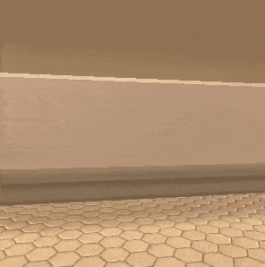
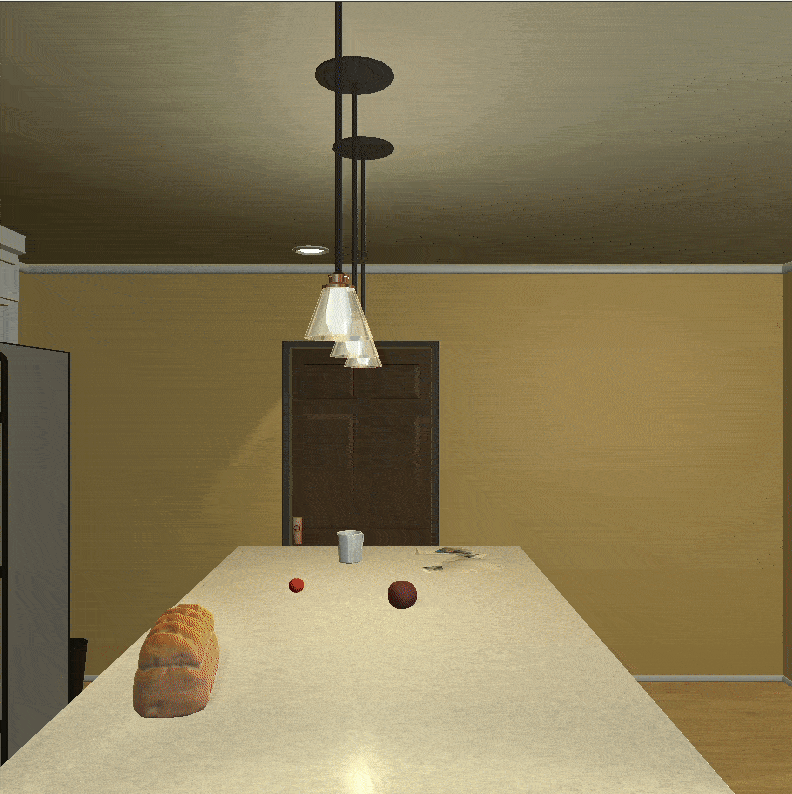

# cups-rl - Customisable Unified Physical Simulations for Reinforcement Learning

This project will focus primarily on the implementation and benchmark of different approaches to 
domain and task transfer learning in reinforcement learning. The focus lies on a diverse set of 
simplified domestic robot tasks using [ai2thor](https://ai2thor.allenai.org/), a realistic household 
3D environment. To provide an example, an agent could learn to pick up a cup under particular 
conditions and then zero/few shot transfer to pick up many different cups in many different 
situations.

We included our own wrapper for the environment as well to support the modification of the tasks 
within an openAI gym interface, so that new and more complex tasks can be developed efficiently to 
train and test the agent.

We have begun a long-running blog series which will go into more detail about this repo and how to use all of the features of our wrapper.

- [From Cups to Consciousness (Part 1): How are cups related to intelligence?](https://towardsdatascience.com/from-cups-to-consciousness-part-1-how-are-cups-related-to-intelligence-8b7c701fa197)
- [From Cups to Consciousness (Part 2): From simulation to the real world](https://medium.com/@TheMTank/from-cups-to-consciousness-part-2-from-simulation-to-the-real-world-a9ea1249e233)

Currently using ai2thor version 0.0.44 and up.
More detailed information on ai2thor environment can be found on their 
[website](http://ai2thor.allenai.org/tutorials/installation).


<div align="center">
  
  <p>A3C agent learning during training on NaturalLanguagePickUpMultipleObjectTask in one of our customized scenes and tasks with the target object being CUPS!</p>
</div>

## Overview

This project will include implementations and adaptations of the following papers as a benchmark of 
the current state of the art approaches to the problem:

- [Ikostrikov's A3C](https://github.com/ikostrikov/pytorch-a3c)
- [Gated-Attention Architectures for Task-Oriented Language Grounding](https://arxiv.org/abs/1706.07230) 
-- *Original code available on [DeepRL-Grounding](https://github.com/devendrachaplot/DeepRL-Grounding)
based on Ikostrikov's A3C* 
- [Rainbow: Combining Improvements in Deep Reinforcement Learning](https://arxiv.org/pdf/1710.02298.pdf) 
-- *Original code available on [Rainbow](https://github.com/Kaixhin/Rainbow) from Kaixhin*


Implementations of these can be found in the algorithms folder and can be run on [AI2ThorEnv](https://arxiv.org/pdf/1710.02298.pdf) with:  

`python algorithms/a3c/main.py`

`python algorithms/rainbow/main.py`

Check the argparse help for more details and variations of running the algorithm with different 
hyperparams and on the atari environment as well.

## Installation

Clone cups-rl repository:

```
# CUPS_RL=/path/to/clone/cups-rl
git clone https://github.com/TheMTank/cups-rl.git $CUPS_RL
```

Install Python dependencies (Currently only supporting python 3.5+):

`pip install -r $CUPS_RL/requirements.txt`

Finally, add `CUPS_RL` to your PYTHONPATH environment variable and you are done.

## How to use

The wrapper is based on OpenAI gym interfaces as described in [gym documentation](https://gym.openai.com/docs/).
Here is a simple example with the default configuration, that will place the agent in a "Kitchen" 
for the task of picking up and putting down mugs. 

```
from gym_ai2thor.envs.ai2thor_env import AI2ThorEnv
N_EPISODES = 20
env = AI2ThorEnv()
max_episode_length = env.task.max_episode_length
for episode in range(N_EPISODES):
    state = env.reset()
    for step_num in range(max_episode_length):
        action = env.action_space.sample()
        state, reward, done, info = env.step(action)
        if done:
            break
```

### Environment and Task configurations

The environment is typically defined by a JSON configuration file located on the `gym_ai2thor/config_files` 
folder. You can find a full example at `config_example.json` to see how to customize it. Here there is 
another one as well:

```
# gym_ai2thor/config_files/myconfig.json
{'pickup_put_interaction': True,
 'open_close_interaction': true,
 'pickup_objects': ['Mug', 'Apple', 'Book'],
 'acceptable_receptacles': ['CounterTop', 'TableTop', 'Sink'],
 'openable_objects': ['Microwave'],
 'scene_id': 'FloorPlan28',
 'gridSize': 0.1,
 'continuous_movement': true,
 'grayscale': True,
 'resolution': (300, 300),
 'task': {'task_name': 'PickUp',
          'target_object': {"Mug": 1}}} 
 ```
 
For experimentation it is important to be able to make slight modifications of the environment 
 without having to create a new config file each time. The class `AI2ThorEnv` includes the keyword 
 argument `config_dict`, that allows to input a python dictionary **in addition to** the config file 
 that overrides the parameters described in the config.

The tasks are defined in `gym_ai2thor/tasks.py` and allow for particular configurations regarding the 
rewards given and termination conditions for an episode. You can use the tasks that we defined
there or create your own by adding it as a subclass of `BaseTask`. 
Here an example of a new task definition:

```
# gym_ai2thor/tasks.py
class MoveAheadTask(BaseTask):
    def __init__(self, *args, **kwargs):
        super().__init__(kwargs)
        self.rewards = []

    def transition_reward(self, state):
        reward = 1 if state.metadata['lastAction'] == 'MoveAhead' else -1 
        self.rewards.append(reward)
        done = sum(rewards) > 100 or self.step_num > self.max_episode_length
        if done:
            self.rewards = []
        return reward, done

    def reset(self):
        self.step_num = 0
``` 

We encourage you to explore the scripts on the `examples` folder to guide you on the wrapper
 functionalities and explore how to create more customized versions of ai2thor environments and 
 tasks. It is possible for the agent to do continuous rotation with 10 degrees by setting 
 `continuous_movement: True` in the config as well, see task_on_ground_variation.py in examples.
 
 In the config `build_file_name` can be set to a file/folder combination within `gym_ai2thor/build_files`. 
 We provide a preliminary unity build that you can download from Google Drive [here](https://drive.google.com/open?id=1UlmAnLuDVBYEiw_xPsGcbuXQTAiNwo8E) 
 but of course you can create your own by following the instructions on the ai2thor repository. We will be adding more builds in the future. 

Here is the desired result of an example task in which the goal of the agent is to place a cup in the 
sink.

<div align="center">
  
  <p>Example of task "place cup in sink"</p>
</div>


## The Team

[MTank](http://www.themtank.org/) is a non-partisan organisation that works solely to recognise the multifaceted 
nature of Artificial Intelligence research and to highlight key developments within all sectors affected by these 
advancements. Through the creation of unique resources, the combination of ideas and their provision to the public, 
this project hopes to encourage the dialogue which is beginning to take place globally. 

To produce value for the individual, for researchers, for institutions and for the world.

## License

This project is released under the [MIT license](https://github.com/TheMTank/cups-rl/master/LICENSE).
